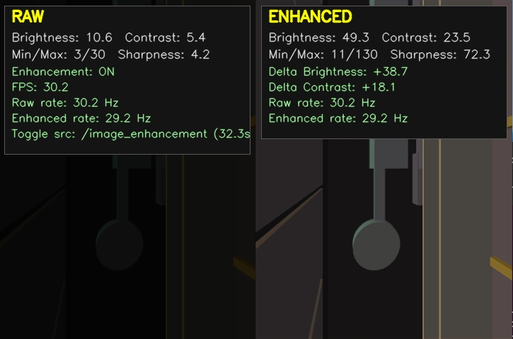

# Sensor Computer Software

> Prerequisite SDKs: Install the [Spinnaker SDK](https://www.teledynevisionsolutions.com/en-au/products/spinnaker-sdk/?model=Spinnaker%20SDK&vertical=machine%20vision&segment=iis) (camera) and the [Livox SDK](https://github.com/Livox-SDK/Livox-SDK) (LiDAR) following their official install guides before building this workspace.

## System Description

The software runs on a dedicated sensor computer and integrates various hardware components to perform real-time data acquisition and processing.

### Key Features
- **LiDAR Integration**: Drivers and processing modules for Livox LiDAR sensors (`ws_livox`) for precise 3D mapping and monitoring.
- **Camera Systems**: Integration with FLIR cameras (`flir_camera_driver`) for high-quality visual monitoring.
- **Image Enhancement**: Custom image enhancement algorithms (`node_pc`) to improve visibility in low-light mine environments.
- **Data Processing**: Timestamp-aware per-frame filtering, image fusion, and point-cloud stacking.
- **Surface Connectivity**: Native ROS 1 TCPROS publishing, with optional ROSBridge and web transform support.

## Repository Structure

- `node_pc`: Main processing node containing scripts for image enhancement, timestamp shifting, and point cloud operations.
- `flir_camera_driver`: Drivers and configuration for FLIR Blackfly S cameras.
- `ws_livox`: ROS drivers for Livox LiDAR sensors.
- `camera_control_msgs`: Custom ROS messages and service definitions for camera control.
- `tf2_web_republisher`: Utilities for republishing TF2 data for web interfaces.

## Monitoring and Diagnostics

### Status Monitor
The status monitor provides a live terminal dashboard for node health and sensor sync:
- Per-topic rates (Hz) with stale detection.
- Timestamp offset between `/livox/lidar_shifted` and `/camera/image_raw`.
- Automatic live Livox-to-ROS clock conversion after each sensor restart;
  rosbag playback retains its fixed recorded conversion.
- Effective image-enhancement status and temperature protection state.

Run it with ROS running and topics available:

```bash
rosrun node_pc monitor_status.py
```

Optional parameters:
- `~image_enchantment_topic` (default `/image_enhancement/status`)
- `/pointcloud_colorizer/image_enchantment` (used if set)
- `/monitor_status/sync_tolerance` (default `0.1` seconds)

## Networking and transports

For two or more independent sensor computers connected to one Surface PC, use
the complete [multi-device deployment guide](docs/MULTI_DEVICE_DEPLOYMENT.md).
It includes the address allocation table, installation commands, persistent
FLIR/Livox settings, native ROS limitation, and multi-ROSBridge connection model.

The colourised output remains `sensor_msgs/PointCloud2` on
`/merged_colored_cloud`. There are two independent ways to consume it:

| Consumer path | Device requirement | Network requirement |
| --- | --- | --- |
| Native TCPROS | The normal publisher; ROSBridge is not involved | Bidirectional reachability. TCP 11311 and the device's effective kernel ephemeral TCP range must be reachable. The subscriber must advertise a callback address the device can reach. |
| ROSBridge WebSocket | ROSBridge and `tf2_web_republisher`; enabled by default and disabled with `ROSBRIDGE=false` | One fixed WebSocket endpoint on TCP 9090. |

Set `ROSBRIDGE=false` when measuring TCPROS without the extra web subscriber.
Enabling it preserves the existing WebSocket and web-TF path.

The fixed endpoints are:

- ROS Master/TCPROS discovery: `http://10.20.0.21:11311`
- Direct device ROSBridge: `ws://10.20.0.21:9090`

### Physical connection quick start

Use the following addresses on the real sensor-to-surface network:

| Machine | Interface address | Role |
| --- | --- | --- |
| Sensor computer | `10.20.0.21/24` | Hosts the ROS master, sensor pipeline, and ROSBridge |
| Surface PC | `10.20.0.10/24` | Connects later as a native or WebSocket subscriber |

Connect both machines to the same Ethernet switch or direct Ethernet link. The
surface PC must actually own `10.20.0.10/24`; putting that address only in a ROS
environment variable does not configure its network interface. On a Linux
surface PC, a temporary direct-link address can be assigned with:

```bash
sudo ip address replace 10.20.0.10/24 dev <surface-interface>
```

Use the operating system's network settings or NetworkManager to make the
surface address persistent. Verify the physical network in both directions
before starting ROS:

```bash
# Run on the surface PC
ping 10.20.0.21

# Run on the sensor computer
ping 10.20.0.10
```

Start the complete stack on the sensor computer. It owns the ROS master, so it
continues acquiring and processing when the Surface PC is absent:

```bash
cd ~/catkin_ws_actual
./check_hardware.sh
./run_hardware.sh
```

When the Surface PC connects, configure every native ROS terminal as follows:

```bash
source /opt/ros/noetic/setup.bash
export ROS_IP=10.20.0.10
export ROS_MASTER_URI=http://10.20.0.21:11311
rostopic list
rostopic hz /merged_colored_cloud
```

For a WebSocket client, connect directly to:

```text
ws://10.20.0.21:9090
```

Confirm ROSBridge is listening on the sensor computer with:

```bash
ss -lnt | grep ':9090'
```

Native ROS requires bidirectional connectivity because nodes advertise their
own callback addresses and dynamically allocated TCP ports. ROSBridge clients
only need access to the sensor's fixed TCP port `9090`.

### Address configuration

There are two separate layers of address configuration:

1. The operating system assigns addresses to the physical interface. On this
   device, NetworkManager's `Wired connection 2` profile keeps the DHCP address
   (currently `129.94.238.20/22`) and also assigns the fixed secondary address
   `10.20.0.21/24` to `eth0`.
2. `network.env` tells ROS which already-assigned address to advertise and where
   to find the ROS Master. Editing `network.env` alone does **not** add or change
   an address on `eth0`.

The repository's `network.env` contains the device's literal fixed address and
its local ROS Master address; neither is derived from the runtime host:

| File | Device address | Master |
| --- | --- | --- |
| `src/node_pc/config/network.env` | `10.20.0.21` | `http://10.20.0.21:11311` |

These private static addresses mirror the real deployment requirement: native
ROS peers must be able to dial the literal address a node advertised. They are
not merely a convenience for Docker. Use statically configured addresses or
DHCP reservations on real links.

Check the two device addresses and the private route with:

```bash
ip -brief address show dev eth0
ip route get 10.20.0.10
```

The expected output includes both the DHCP address and `10.20.0.21/24`, while
the route to the surface uses `src 10.20.0.21`.

#### Changing the fixed sensor IP

The NetworkManager address and `ROS_IP` represent the same sensor address, but
they have different jobs. NetworkManager assigns it to `eth0`; `ROS_IP` tells
ROS to advertise it. The values must match, with the subnet suffix used only by
NetworkManager:

```text
NetworkManager address: 10.20.0.21/24
ROS_IP:                 10.20.0.21
```

To change the fixed sensor address, update both layers. For example, replacing
it with `10.20.0.22/24` requires:

```bash
sudo nmcli connection modify "Wired connection 2" \
  ipv4.addresses 10.20.0.22/24
sudo nmcli device reapply eth0
```

Then change `ROS_IP` in `src/node_pc/config/network.env`:

```bash
ROS_IP=10.20.0.22
```

Restart the pipeline after changing `network.env`. Also update every ROSBridge
client URL to `ws://10.20.0.22:9090`. If the new address remains inside
`10.20.0.0/24`, the surface PC may stay at `10.20.0.10/24` and
`ROS_MASTER_URI` does not change. If the subnet or surface address changes,
update the surface interface, `ROS_MASTER_URI`, routes, and firewall rules too.

Reapplying a network profile can affect active connections. Do it from a local
console when changing or removing the address used for remote access. The
surface PC must remain in the same subnet, for example `10.20.0.10/24`.

| Variable | Meaning | Repository default | Set it in |
| --- | --- | --- | --- |
| `ROS_IP` | Address advertised by every node for XML-RPC and TCPROS callbacks | `10.20.0.21` | `network.env`; it **must be a literal IPv4 address**, never a name |
| `ROS_MASTER_URI` | Sensor-hosted ROS Master used by the device and Surface clients | `http://10.20.0.21:11311` | `network.env` |
| `ROSBRIDGE_ADDRESS` | Local ROSBridge bind address | `0.0.0.0` | `network.env` |
| `ROSBRIDGE_PORT` | Fixed ROSBridge WebSocket port | `9090` | `network.env` |
| `NODE_PC_NETWORK_CONFIG` | Optional location of the canonical network file | `<workspace>/src/node_pc/config/network.env` | `deploy/node-pc.service` only when the workspace/config path differs |
| `ROSBAG` | `false` starts the hardware drivers; `true` omits only those drivers so raw topics can come from a bag while the remaining pipeline keeps running | `false` | Shell for a one-off run, or `deploy/node-pc.service` for deployment |
| `ROSBRIDGE` | Whether ROSBridge and the web TF republisher start | `true` | Shell for a one-off run, or `deploy/node-pc.service` for deployment |

`run_pipeline.sh` loads the selected file before `roslaunch`. The systemd unit
uses `EnvironmentFile=` because systemd does not read `~/.bashrc`, and also gives
the wrapper the same file through `NODE_PC_NETWORK_CONFIG`. The launch
passes both values explicitly to every child and logs the resolved advertised
address. A loopback address, unassigned address, or name produces a prominent
startup error.

The current design runs one Master at `10.20.0.21` on the sensing device. Sensor
acquisition and processing therefore start without the Surface PC. A Surface
client that connects later points `ROS_MASTER_URI` to the device and advertises
its own reachable `10.20.0.10` address through `ROS_IP`.

Use static addressing or a DHCP reservation for both the sensing unit and the
surface subscriber. If an address changes after reboot, advertised callbacks or
the Master URL become stale: registration can appear to work while the direct
TCPROS socket fails.

## Testing without sensor hardware

Docker, rosbag, network-emulation, and synthetic publisher instructions are
kept separate from the real-device setup. See [Testing without sensor
hardware](docs/TESTING.md).

## Device deployment and diagnostics

### systemd startup

Review the user, paths, addresses, and `ROSBAG` setting in
`deploy/node-pc.service`, then install it:

```bash
sudo install -m 0644 deploy/node-pc.service /etc/systemd/system/node-pc.service
sudo systemctl daemon-reload
sudo systemctl enable --now node-pc.service
systemctl status node-pc.service
```

The unit has both `Wants=network-online.target` and
`After=network-online.target`, so its static device address is available before
ROS starts. This waits for the local network configuration, not for the surface
machine.

### Firewall

Provision UFW with the actual surface subnet. The script reads
`/proc/sys/net/ipv4/ip_local_port_range` on the device at runtime; it never
hard-codes or guesses the dynamic range.

```bash
sudo scripts/provision_firewall.sh 10.20.0.0/24
# Add the fixed WebSocket port when ROSBridge is enabled:
sudo scripts/provision_firewall.sh 10.20.0.0/24 --rosbridge
```

The surface subnet is a required parameter. ROS node XML-RPC and TCPROS servers
receive dynamic ports from the system's effective ephemeral range, so the rule
cannot safely be narrowed to one observed port. The script neither disables nor
enables UFW.

### Publisher diagnostics

Run this on the sensing unit while the publisher and surface subscriber are
running:

```bash
scripts/publisher_diagnostics.sh
# Optional node and topic overrides:
scripts/publisher_diagnostics.sh /pointcloud_colorizer /merged_colored_cloud
```

It reports the node's advertised XML-RPC address, its process ID, established
connections and remote endpoints from `ss -tnp`, and the published type's
message-definition MD5. Use `sudo` if `ss` cannot show process ownership.

### Troubleshooting

| Symptom | Likely cause | Confirm with |
| --- | --- | --- |
| Subscriber registers but receives no messages | The device advertised loopback/a name, the dynamic inbound range is blocked, or the subscriber callback is unreachable from the device | `rosnode info /pointcloud_colorizer` and `sudo scripts/publisher_diagnostics.sh`; on the device also run `sudo ufw status numbered` |
| TCP connects and immediately closes, often reported as a header error | The Windows client's vendored message definition has a different MD5 | `rosmsg md5 sensor_msgs/PointCloud2` on the device and compare it with the client's compiled/vendored MD5; `scripts/publisher_diagnostics.sh` prints the device value |
| Pipeline works after SSH login but not after reboot | The service has stale/missing environment values, a wrong path/user, or started before usable networking | `systemctl show node-pc.service -p Environment` and `journalctl -u node-pc.service -b` |
| ROSBridge works but native TCPROS does not | TCP 9090 is open, but the bidirectional native ROS ports or advertised addresses are not | `sudo scripts/publisher_diagnostics.sh` and `sudo ufw status numbered` |

## Timestamp-aware enhancement and fusion pipeline

The production path is:

```text
LiDAR -> timestamp correction -> 10-frame indexed stack
      -> voxel/radius filtering per source frame
Camera -> SBC-optimized Model V3 enhancement per image
      -> maximum-cardinality one-to-one timestamp matching
      -> colourize matched source groups -> timestamp-aware PointCloud2
```

`image_enhancer.py` uses the frozen, BatchNorm-fused TorchScript graph in
`scripts/SBC inference/model_cpu.pt`. The ROS adapter converts BGR arrays
directly to tensors without PIL or torchvision, runs one bounded inference
worker, preserves the camera header, and publishes only genuine enhanced
frames. The user requests raw/enhanced mode on `/image_enhancement`, while the
latched `/image_enhancement/status` topic reports the effective mode actually
used by enhancement, merging, and colourisation. A mode change flushes
incomplete LiDAR and image batches so one output can never mix the two modes.

For continuous operation, enhancement is capped at 5 FPS rather than attempting
to process every camera frame. The existing enhancer process reads the SoC
thermal sensor once every 30 seconds and publishes the value in degrees Celsius
as `std_msgs/Float32` on the latched `/temperature` topic. This creates no extra
ROS process and adds only one small sysfs read per interval.

Thermal protection uses hysteresis. At or above 85 C, effective enhancement is
disabled and the pipeline automatically continues with raw images. The user's
ON request is retained; when the temperature reaches 70 C or below, enhancement
is restored automatically. If the sensor cannot be read, enhancement is safely
disabled while the raw pipeline continues. The thresholds, polling interval,
sensor path, topic, and frame-rate cap are configurable under `image_enhancer`
in `config/pipeline.yaml`:

```yaml
temperature_topic: "/temperature"
temperature_path: "/sys/class/thermal/thermal_zone0/temp"
temperature_poll_interval: 30.0
thermal_protection: true
thermal_shutdown_temperature: 85.0
thermal_resume_temperature: 70.0
max_fps: 5.0
```

User-interface integration and command-line checks:

```bash
# User request
rostopic pub -1 /image_enhancement std_msgs/Bool "data: true"
rostopic pub -1 /image_enhancement std_msgs/Bool "data: false"

# Values to display to the user
rostopic echo /image_enhancement/status
rostopic echo /temperature
```

The UI toggle represents the user's request, but its ON/OFF indicator should
read `/image_enhancement/status` so an automatic thermal shutdown is visible.

Each point in `/merged_colored_cloud` carries:

- `source_frame_index`
- `source_frame_stamp_sec` and `source_frame_stamp_nsec`
- `image_stamp_sec` and `image_stamp_nsec`

The cloud header is the newest retained source-frame timestamp. Every
source-frame group is filtered independently and may match at most one distinct
camera image within `sync_tolerance`. By default, a partial output is published
when at least 3 of the 10 source groups match; unmatched groups and their points
are omitted. Set `allow_partial_batches: false` to restore strict 10/10 output.

On a ROCK 5A, prepare the runtime with:

```bash
cd "src/node_pc/scripts/SBC inference"
./install_rock5a.sh
export NODE_PC_INFERENCE_PYTHON="$PWD/.venv/bin/python"
```

Benchmark TorchScript and ONNX on the actual board before changing the default
backend or thread count; host/x86 timing is not representative of RK3588S
performance.

The native nodes are compiled with `-O3`. When compiling directly on the ROCK
5, `NODE_PC_NATIVE_OPTIMIZATION=ON` (the default) also enables CPU-specific
instructions. Disable that option for a portable binary or when cross-compiling:

```bash
catkin_make -DNODE_PC_NATIVE_OPTIMIZATION=OFF
```

For the default filter, voxel reduction runs before the more expensive radius
neighbour search to reduce its working set. Set
`pointcloud_voxel_filter/voxel_before_radial: false` only when reproducing the
old radius-then-voxel ordering is more important than SBC throughput.

### Raw vs Enhanced Example



## License

This software is proprietary and confidential.

**Copyright (c) 2026 The University of New South Wales (UNSW). All rights reserved.**

See the [LICENSE](LICENSE) file for full details.
