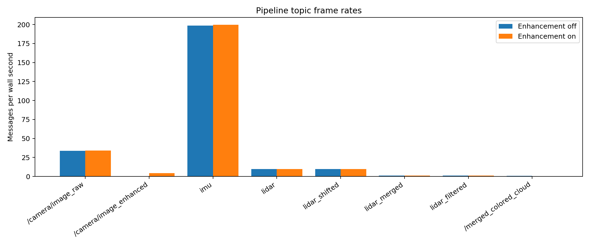
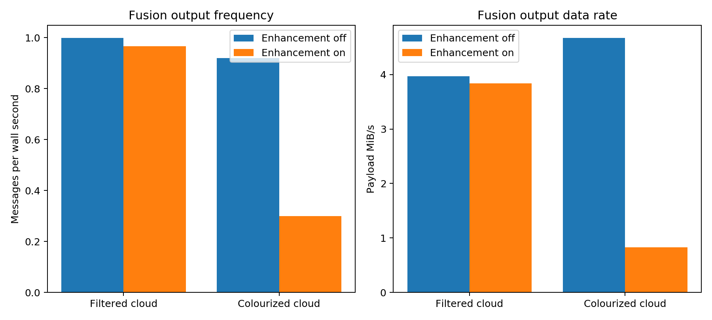
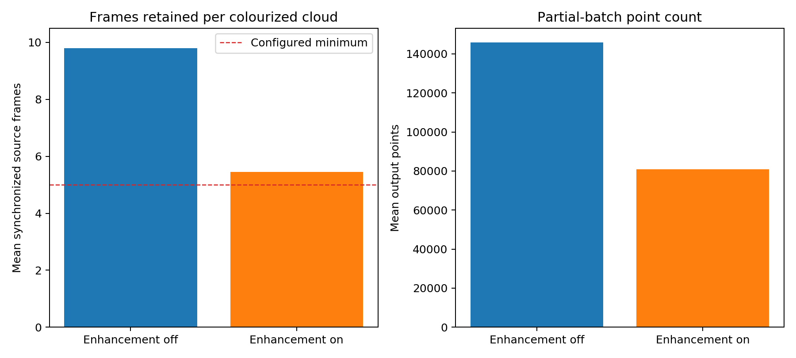
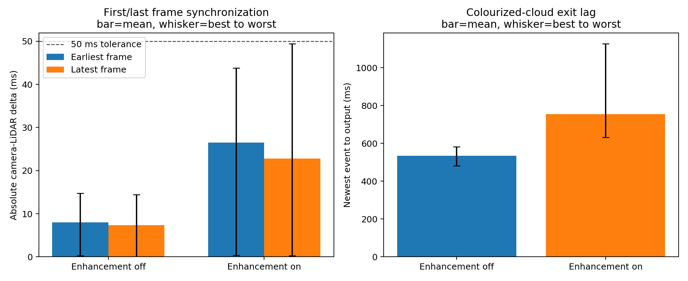
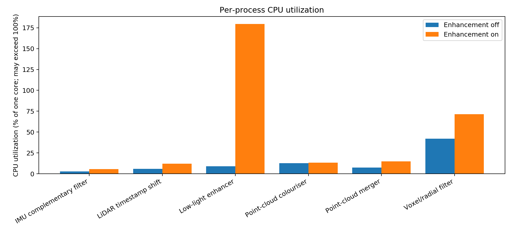
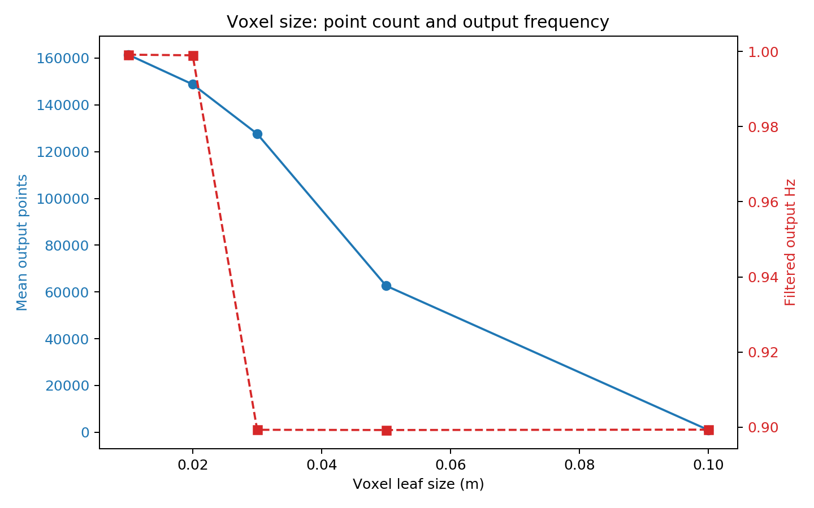
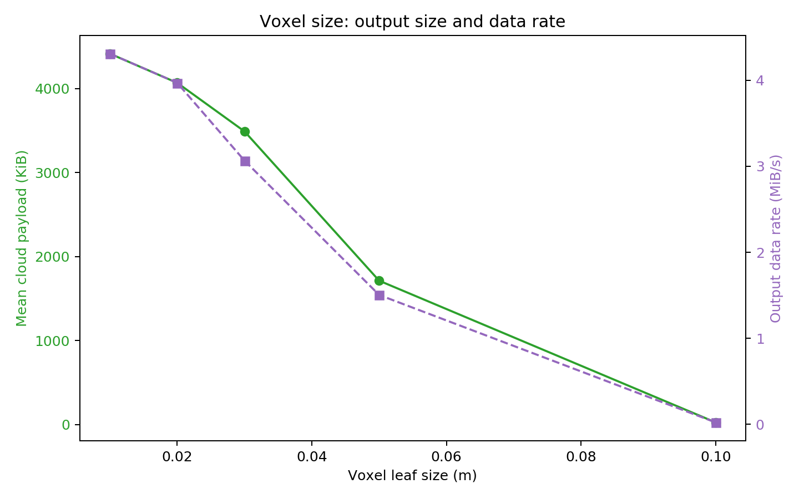

# Sensor pipeline performance report

Benchmark date: 8 September 2026  
Platform: Ubuntu 20.04, ROS Noetic, ARM64 ROCK 5A, 8 online CPU cores, 15 GiB RAM  
Controlled input: `2025-02-14-16-45-34_with.bag`, replayed continuously at 1x with recorded clock  
Pipeline mode: `ROSBAG=true`, sensor drivers disabled, ROSBridge disabled  
Partial-batch rerun: 25 seconds enhancement-off and 30 seconds enhancement-on

## Executive summary

The LiDAR pipeline sustained its designed cadence: approximately 9.7--9.9 raw
scans/s were stacked in groups of 10 and produced approximately 1.0 merged and
filtered cloud/s. With raw camera images, the corrected pipeline produced
colourized clouds at `0.919 Hz`, `148,109 points/cloud`, and `4.673 MiB/s`.

With normal pipeline load and a single final-output observer, the new partial
policy produced 37 enhanced colourized clouds in 40 seconds (`0.925 Hz`). Those
outputs retained an average of `7.62/10` source frames, with a range of 5--9.
This is close to the intended one combined view per second and is substantially
better than the previous `0.240 Hz` all-or-nothing result.

The previous zero `/merged_colored_cloud` result was fixed by changing the LiDAR
clock conversion from `1739263380.384177 s` to the bag-compatible
`1739510486.944657 s`, a difference of `247106.560480 s`. The final timestamp is
now calculated as `LiDAR header + clock conversion + 0.03243 s capture offset`.
The sustained enhanced run also exposed thermal throttling: the board reached
`84.1 C`, CPU0 fell to `408 MHz`, and enhancement throughput fell to `4.46 FPS`.
The full-topic instrumentation run consequently produced `0.300 Hz`, 5--6
retained frames, and about 80,906 points/output. This is a stress/observer-effect
result: subscribing to every large intermediate cloud adds serialization and
memory-bandwidth load. Better cooling remains important for sustained operation.

## Topic throughput

Rates use wall time, not simulated ROS time. This table is the full-instrumentation
stress run, where the benchmark subscribes to every large intermediate topic.

| Topic | Enhancement off | Enhancement on | Mean message payload | Meaning |
| --- | ---: | ---: | ---: | --- |
| `/camera/image_raw` | 33.81 Hz, 5.71 MiB/s | 33.97 Hz, 5.74 MiB/s | 173.04 KiB | Recorded Bayer camera input |
| `/camera/image_enhanced` | 0 Hz | 4.46 Hz, 2.26 MiB/s | 519.02 KiB | Thermally throttled enhanced output |
| `/livox/imu` | 198.72 Hz | 199.57 Hz | 0.32 KiB | Recorded Avia IMU input |
| `/livox/lidar` | 9.79 Hz, 4.03 MiB/s | 9.86 Hz, 4.06 MiB/s | 24,000 points / 421.88 KiB | Recorded Avia cloud input |
| `/livox/lidar_shifted` | 9.83 Hz | 9.86 Hz | 24,000 points / 421.88 KiB | Timestamp-adjusted cloud |
| `/livox/lidar_merged` | 1.00 Hz | 0.97 Hz | 240,000 points / 7,968.75 KiB | Ten-frame stack |
| `/livox/lidar_filtered` | 1.00 Hz | 0.97 Hz | about 148,780 points / 4,068 KiB | Default 2 cm filter output |
| `/merged_colored_cloud` | 0.919 Hz, 4.673 MiB/s | 0.300 Hz, 0.832 MiB/s | off: 148,109 points / 5,207 KiB; on: 80,906 / 2,844 KiB | Partial timestamp-matched RGB cloud |





## Partial-batch configuration and results

The C++ colourizer now performs maximum-cardinality, minimum-timestamp-error
one-to-one matching. It waits for the image-time watermark or `0.30` wall seconds,
then publishes only matched source groups when at least five are available.
Unmatched LiDAR groups are removed rather than assigned incorrect or black colour.

```yaml
allow_partial_batches: true
min_synchronized_frames: 5
sync_tolerance: 0.05
partial_batch_timeout: 0.30
```

| Test load | Successful outputs | Output rate | Mean matched frames | Range | Mean output points |
| --- | ---: | ---: | ---: | ---: | ---: |
| Focused, enhancement off | 22 in 25 s | 0.880 Hz | 10.00 / 10 | 10 | not sampled |
| Focused, enhancement on | 37 in 40 s | 0.925 Hz | 7.62 / 10 | 5--9 | not sampled |
| Full instrumentation, enhancement off | 23 in 25 s | 0.919 Hz | 9.80 / 10 | 8--10 | about 148,109 |
| Full instrumentation, enhancement on | 9 in 30 s | 0.300 Hz | 5.44 / 10 | 5--6 | about 80,906 |

The small raw-mode loss is caused by the short rosbag resetting every 9.8 seconds;
normal uninterrupted intervals retain 10/10 frames. In enhancement-on mode,
successful partial clouds meet the five-frame minimum, while batches with only
0--4 matches are rejected. The focused run demonstrates the normal output rate;
the full-instrumentation result quantifies worst-case observer and thermal load.

The node publishes latched runtime diagnostics on:

- `/merged_colored_cloud/matched_frames`
- `/merged_colored_cloud/input_frames`
- `/merged_colored_cloud/point_count`
- `/merged_colored_cloud/dropped_batches`



## Timestamp and RGB validation

- The controlled bag contains 97 LiDAR scans. After correction, 96 of 97 have a
  nearest raw camera frame within the configured 50 ms tolerance. Median nearest
  error is `9.12 ms`; the single `56.06 ms` edge scan occurs at the short bag's
  loop boundary.
- A sampled published coloured cloud contained 148,266 points, ten distinct
  source-frame groups, the `rgb` field, and source/image provenance timestamps.
- Its ten selected image deltas ranged from `-27.82 ms` to `+35.01 ms`, all
  inside tolerance. All 148,266 points carried a non-black packed RGB value.
- The 25-second raw-mode sample produced 23 coloured clouds from 25 filtered
  clouds. Short-bag time resets account for the boundary losses and inflated
  95th-percentile period; they are not representative of uninterrupted sensors.

## First and last frames stay within 50 ms; enhancement adds exit delay

For synchronization, signed delta means `camera timestamp - corrected LiDAR
timestamp`. A negative value means the selected camera frame is earlier; a
positive value means it is later. Absolute values describe alignment error
without direction.

| Position and mode | Signed average | Signed range | Absolute average | Best absolute | Worst absolute |
| --- | ---: | ---: | ---: | ---: | ---: |
| Earliest frame, enhancement off | -7.09 ms | -14.76 to +3.72 ms | 8.00 ms | 0.24 ms | 14.76 ms |
| Latest frame, enhancement off | +0.14 ms | -14.46 to +13.90 ms | 7.38 ms | 0.001 ms | 14.46 ms |
| Earliest retained frame, enhancement on | -3.75 ms | -43.80 to +43.47 ms | 26.47 ms | 0.37 ms | 43.80 ms |
| Latest retained frame, enhancement on | -0.01 ms | -49.46 to +46.19 ms | 22.78 ms | 0.24 ms | 49.46 ms |

Across every retained source/image pair, not just the first and last:

| Mode | Mean absolute difference | Best | Worst | Configured limit |
| --- | ---: | ---: | ---: | ---: |
| Enhancement off | 7.45 ms | 0.001 ms | 15.07 ms | 50 ms |
| Enhancement on | 23.15 ms | 0.001 ms | 49.46 ms | 50 ms |

The acquisition span from the earliest to latest retained LiDAR frame was:

| Mode | Average span | Best/shortest | Worst/longest |
| --- | ---: | ---: | ---: |
| Enhancement off, 10/10 frames | 900.16 ms | 899.78 ms | 900.54 ms |
| Enhancement on, 5--9 frames | 813.44 ms | 399.73 ms | 900.18 ms |

The completed colourized cloud left the pipeline this long after its newest
retained LiDAR event timestamp:

| Mode | Average exit lag | Best | Worst |
| --- | ---: | ---: | ---: |
| Enhancement off | 534.20 ms | 482.00 ms | 582.31 ms |
| Enhancement on | 755.27 ms | 631.95 ms | 1127.33 ms |

The same output moment measured from both the earliest and latest retained
sensor timestamps is:

| Mode and reference timestamp | Average | Best | Worst |
| --- | ---: | ---: | ---: |
| Enhancement off: output minus earliest LiDAR | 1434.38 ms | 1382.21 ms | 1482.46 ms |
| Enhancement off: output minus earliest camera | 1441.97 ms | 1394.27 ms | 1497.22 ms |
| Enhancement off: output minus latest LiDAR | 534.20 ms | 482.00 ms | 582.31 ms |
| Enhancement off: output minus latest camera | 533.46 ms | 477.74 ms | 595.24 ms |
| Enhancement on: output minus earliest retained LiDAR | 1564.04 ms | 1356.13 ms | 1827.39 ms |
| Enhancement on: output minus earliest paired camera | 1568.35 ms | 1313.47 ms | 1871.20 ms |
| Enhancement on: output minus latest retained LiDAR | 755.27 ms | 631.95 ms | 1127.33 ms |
| Enhancement on: output minus latest paired camera | 754.53 ms | 631.71 ms | 1124.54 ms |

Exit lag was measured as `ROS /clock time at output callback - output header
timestamp` during 1x rosbag playback. It includes merger completion, voxel/radius
filtering, synchronization waiting, and colourization. It is not a direct measure
of live Ethernet transport delay. The partial output header is the timestamp of
the latest retained LiDAR frame, and every point continues to carry both exact
LiDAR and selected-image timestamps.



## Process execution cost and parallel behavior

CPU percentage is Linux process CPU usage where 100% equals one fully occupied
core. CPU milliseconds/input is derived from CPU usage divided by measured input
rate; it is a CPU-cost estimate, not instrumented callback wall latency.

| Process | CPU off | CPU on | RSS off/on | Estimated CPU ms/input off | Estimated CPU ms/input on |
| --- | ---: | ---: | ---: | ---: | ---: |
| LiDAR timestamp shift | 5.9% | 12.0% | 19.5 / 19.6 MiB | 6.01 | 12.14 |
| Point-cloud merger | 7.5% | 15.0% | 23.1 / 24.0 MiB | 7.61 | 15.25 |
| Voxel/radial filter | 42.0% | 71.5% | 91.4 / 91.6 MiB | 420.02 per merged cloud | 740.13 per merged cloud |
| Low-light enhancer | 8.9% | 179.6% | 198.0 / 340.0 MiB | 2.63 per raw frame while disabled | 52.89 per received raw frame |
| Point-cloud colouriser | 12.6% | 13.4% | 86.2 / 90.9 MiB | 126.53 per filtered cloud | 138.72 per filtered cloud |
| IMU complementary filter | 2.8% | 5.5% | 18.9 / 18.9 MiB | 0.139 | 0.275 |

During thermal throttling, the enhancer consumed approximately `402.6 CPU ms`
per produced frame (`179.64% / 4.46 FPS`). Its configured four worker threads run
on CPUs 4--7. Total machine utilization was 42.54% of eight cores with enhancement
off and 89.44% with it on: 3.40 and 7.16 equivalent cores. These numbers describe
sustained hot operation and should not be compared to an actively cooled board.



## Per-event and per-output execution cost

The following table answers how much processing time each individual stage used
per input event and per output it produced. These are measured **CPU-time
estimates**, calculated from sampled process CPU consumption and measured
wall-time message counts:

`CPU ms/event = mean process CPU % × 10 / event rate (Hz)`

This is more useful than callback-to-callback wall time for parallel ROS nodes:
multiple stages run concurrently, so their CPU costs must not be added and
treated as serial latency. Exact callback wall latency would require adding
timing instrumentation inside the production nodes and would change the code
being benchmarked.

| Stage | Mode | Input rate | Output rate | CPU ms/input event | CPU ms/produced output |
| --- | --- | ---: | ---: | ---: | ---: |
| LiDAR timestamp shift | Enhancement off | 9.79 Hz | 9.83 Hz | 6.01 | 5.98 |
| LiDAR timestamp shift | Enhancement on | 9.86 Hz | 9.86 Hz | 12.14 | 12.14 |
| Ten-cloud merger | Enhancement off | 9.83 Hz | 1.00 Hz | 7.61 | 74.87 |
| Ten-cloud merger | Enhancement on | 9.86 Hz | 0.97 Hz | 15.25 | 155.63 |
| Voxel/radial downsampling | Enhancement off | 1.00 Hz | 1.00 Hz | 420.02 | 420.02 |
| Voxel/radial downsampling | Enhancement on | 0.97 Hz | 0.97 Hz | 740.13 | 740.13 |
| Low-light enhancement | Enhancement off | 33.81 Hz | 0 Hz | 2.63 idle/dispatch cost | N/A (disabled) |
| Low-light enhancement | Enhancement on | 33.97 Hz | 4.46 Hz | 52.89 | 402.58 |
| Synchronization/colourisation | Enhancement off | 1.00 cloud/s | 0.919 Hz | 126.53 per attempted cloud | 137.53 |
| Synchronization/colourisation | Enhancement on | 0.97 cloud/s | 0.300 Hz | 138.72 per attempted cloud | 446.98 effective CPU cost |
| IMU complementary filter | Enhancement off | 198.72 Hz | approximately 198.72 Hz | 0.139 | approximately 0.139 |
| IMU complementary filter | Enhancement on | 199.57 Hz | approximately 199.57 Hz | 0.275 | approximately 0.275 |

Interpretation:

- Timestamp correction is inexpensive at roughly 6--12 ms of CPU per scan.
- Merging ten scans costs roughly 75--156 ms of CPU for each merged output.
- Downsampling is the largest point-cloud cost: about 420 ms/output with
  enhancement off and 740 ms/output in the thermally constrained enhanced run.
- One throttled enhanced image costs about 403 ms of aggregate CPU time. Because
  four worker threads execute in parallel, CPU time is not wall latency.
- Colourization costs about `138 CPU ms` per successful raw-mode output. The
  enhanced-mode `447 ms/output` is an effective cost including attempted batches
  that did not meet the five-frame threshold.
- The total pre-colourization LiDAR CPU work represented by ten timestamp events,
  one merge, and one filtered output is approximately 555 CPU ms with
  enhancement off and 1,017 CPU ms with enhancement on. Since the ROS processes
  operate concurrently, the observed output cadence still remains about 1 Hz.

## Voxel-size sweep

Enhancement was disabled for this sweep. Each value was applied through the
existing `/voxel_leaf_size` runtime topic; the production value was restored to
`0.02 m` afterward. The radial filter and all other parameters stayed unchanged.

| Voxel size | Mean points | Reduction vs 1 cm | Mean cloud payload | Output data rate | Output frequency |
| ---: | ---: | ---: | ---: | ---: | ---: |
| 0.01 m | 161,468 | baseline | 4,415.13 KiB | 4.308 MiB/s | 0.999 Hz |
| 0.02 m | 148,770 | 7.9% | 4,067.93 KiB | 3.969 MiB/s | 0.999 Hz |
| 0.03 m | 127,626 | 21.0% | 3,489.77 KiB | 3.065 MiB/s | 0.899 Hz |
| 0.05 m | 62,652 | 61.2% | 1,713.13 KiB | 1.504 MiB/s | 0.899 Hz |
| 0.10 m | 964 | 99.4% | 26.35 KiB | 0.023 MiB/s | 0.899 Hz |

The nominal algorithm output is one cloud/s because ten 10 Hz source frames are
merged. The 0.899 Hz readings represent nine messages landing inside a 10-second
measurement boundary; they do not prove a sustained computational slowdown.
Longer runs are recommended before attributing a sub-1 Hz difference to voxel
processing. The point-count and bandwidth reductions, however, are large and
consistent. The 5 cm setting is a useful bandwidth/geometry tradeoff; 10 cm is
extremely aggressive for this dataset.





## Real-time assessment

- LiDAR timestamp, ten-frame stacking, radial/voxel filtering, and IMU filtering
  keep pace with recorded sensor input in both modes.
- Under the full-topic instrumentation load, low-light enhancement fell to
  4.46 FPS after thermal throttling. Its latest-frame queue prevents an
  ever-growing backlog, but intentionally discards stale raw images.
- Enabling enhancement increased total CPU load by about 46.90 percentage points
  of the eight-core machine (3.75 equivalent cores) in this sustained run.
- Cloud bandwidth at the default 2 cm voxel is about 3.97 MiB/s before TCPROS
  serialization/network overhead.
- Raw-image colourization remains real-time at approximately 1 Hz. Partial mode
  produced valid 5--9-frame enhanced clouds at `0.925 Hz` under focused normal
  observation. Full intermediate-topic instrumentation reduced this to 0.30 Hz;
  adequate cooling is still recommended for stable deployment performance.

## IP-address configuration

The deployment addresses are fixed in `src/node_pc/config/network.env`:

- Sensor computer `ROS_IP`: `10.20.0.21`
- Surface ROS master: `http://10.20.0.10:11311`
- ROSBridge bind address: `0.0.0.0`, port `9090`

These are fixed application settings, but the operating system currently has
`129.94.238.20/22` on `eth0`; it does **not** currently own `10.20.0.21`.
During this local benchmark only, ROS used loopback `127.0.0.1` through a
temporary runtime environment file. Before real deployment, the correct sensor
network interface must be assigned `10.20.0.21` (or the configuration must be
changed to the actually reserved address).

## Reproduction and raw data

The `raw/` directory contains the updated synchronized wall-time topic CSVs,
first/last-frame samples, `pidstat`, `mpstat`, voxel sweep data, process mappings,
and the earlier multi-bag exploratory pass. `measure_topics.py`,
`measure_partial_batches.py`, `measure_sync_edges.py`, `measure_cloud.py`,
`summarize_results.py`, and `plot_results.py` reproduce the analysis without
modifying production nodes.
